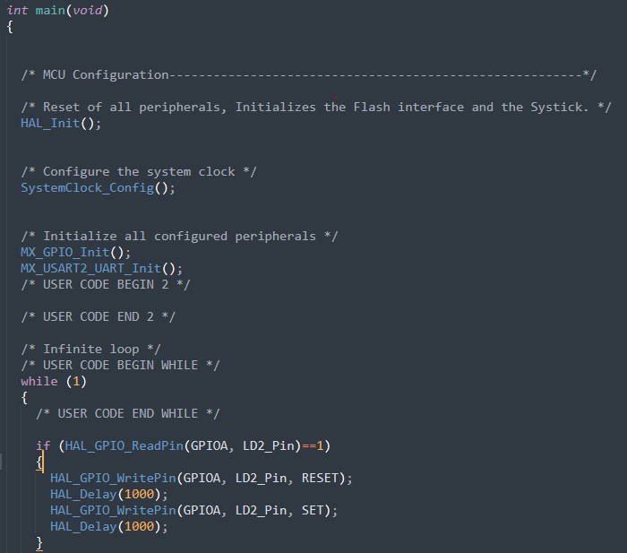
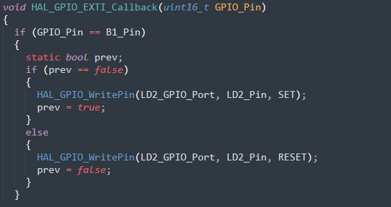

**Homework 3 - Blinky																				L. Larsen**

__________________________________

**Board Used**

____________

My discovery board hadn't arrived yet when I started this assignment, so **STM32F103 Nucleo-64** was what I had on hand.  

**Algorithm**

_______________________

In main(), if the LED state is '1', the LED (LD2, GPIO pin 5) starts blinking with a duty cycle of 1 sec.  If the blue button (B1) is pressed, an interrupt occurs and the LED turns off, if the button is pressed again, the LED turns on and begins toggling.  Did not implement debounce logic, but can definitely see where it would be a good idea.  

From main.c

from gpio.c

**Questions**:

_______________

1. *What are the hardware registers that cause the LED to turn on and off?*  

​		From what I can ascertain from reading the datasheet, Port A ODR register (0x4001080c) should be the 		register responsible for turning on/off the LED.  

2.  *What are the registers that you read in order to find out the state of the button?*

    For the board used, Port C IDR (Input Data Register), address 0x40011008 should be the register responsible for determining the state of the button.  

3.  *Can you read the register directly and see the button change in a debugger or by printing out the value of the memory at the register’s address?*

   Yes, theoretically.  Was I able to do so?  No.  It's frustrating that I was not able to figure this out since I know it's possible, but I did not accomplish this personally.  
